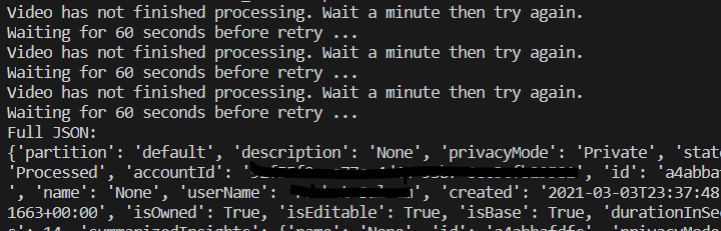
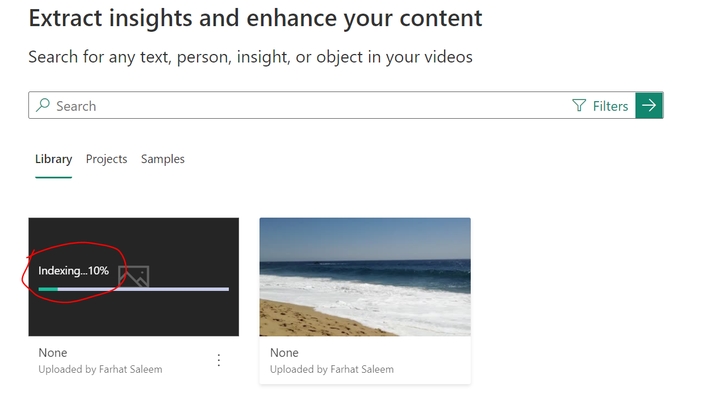

# Video Indexer

This repository contains sample python scripts for using the Video Indexer API to Upload media file and search for text.

## Prerequisites

1) Create a Video Indexer Account using the steps [here](https://docs.microsoft.com/en-us/azure/media-services/video-indexer/connect-to-azure).
1) Make a note of your Account ID.
1) Make note of the Indexer Location. We used a trial version.
1) Subscribe to the Video Indexer API by following steps [here](https://docs.microsoft.com/en-us/azure/media-services/video-indexer/video-indexer-use-apis#subscribe-to-the-api).
1) Make a note of the Primary API Key.
1) Install [Visual Studio Code](https://code.visualstudio.com/).
1) Install the Python extension by following the instructions [here](https://marketplace.visualstudio.com/items?itemName=ms-python.python).

## Executing Python scripts 

Clone the repository and follow the below instructions to execute the python scripts. Look through the python scripts to see example of calling the Video Indexer API.

### Upload Media File

Execute the [UploadFile.py](src/UploadFile.py).

~~~bash
 python src/UploadFile.py -a <account id> -k <api Key> -l <indexer location> -f <file path to upload> 
~~~

For example:

~~~bash
python src/UploadFile.py -a aaaaaaaa-bbbb-cccc-dddd-eeeeeeeeeeee -k abcdefg12345 -l trial -f data/beach_waves_narrated.mp4 
~~~

The script will upload the media file and then check for processing status every minute until processed and outputs the Full JSON response from the API will all the insights.

If you log in to the [Video Indexer Portal](https://www.videoindexer.ai/), and go to Media Files. You should see the upload happening.

### Search for Text

Execute the [Search.py](src/Search.py).

~~~bash
 python src/Search.py -a <account id> -k <api Key> -l <indexer location> -q <query> 
~~~

For example:

~~~bash
python src/Search.py -a aaaaaaaa-bbbb-cccc-dddd-eeeeeeeeeeee -k abcdefg12345 -l trial -q "coronado"
python src/Search.py -a aaaaaaaa-bbbb-cccc-dddd-eeeeeeeeeeee -k abcdefg12345 -l trial -q "coronado beach" 
~~~

Results are returned in JSON format. 

~~~bash
{'results': [{'accountId': 'aaaaaaaa-bbbb-cccc-dddd-eeeeeeeeeeee', 'id': '368b37c2b4', 'partition': 'default', 'externalId': None, 'metadata': None, 'name': 'None', 'description': 'None', 'created': '2021-03-03T22:25:39.151+00:00', 'lastModified': '2021-03-03T22:31:33.081+00:00', 'lastIndexed': '2021-03-03T22:25:44.172+00:00', 'privacyMode': 'Private', 'userName': 'Farhat Saleem', 'isOwned': True, 'isBase': True, 'hasSourceVideoFile': True, 'state': 'Processed', 'moderationState': 'OK', 'reviewState': 'None', 'processingProgress': '100%', 'durationInSeconds': 13, 'thumbnailVideoId': '368b37c2b4', 'thumbnailId': '49671fad-b4a7-4414-b0a5-d14cb628dc1f', 'searchMatches': [{'startTime': '00:00:00', 'type': 'Transcript', 'text': "Here's a few shots of the waves in Coronado Beach", 'exactText': 'Coronado'}, {'startTime': '00:00:00', 'type': 'NamedLocation', 'text': 'Coronado Beach', 'exactText': 'Coronado'}], 'indexingPreset': 'Default', 'streamingPreset': 'Default', 'sourceLanguage': 'en-US', 'sourceLanguages': ['en-US'], 'personModelId': '00000000-0000-0000-0000-000000000000'}], 'nextPage': {'pageSize': 25, 'skip': 0, 'done': True}}
~~~